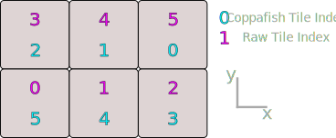

## Input data

Coppafish requires raw, `uint16` microscope images, metadata, and a configuration file. We currently only support raw
data in ND2, JOBs, or numpy format. If your data is not already in one of these formats, we recommend configuring your
data into [numpy](#numpy) format.

There must be an anchor round. There must be an anchor channel (this can be a sequencing channel). There must be a dapi
channel in every sequencing round and the anchor round. The tiles must have at least four z planes. Use a number of z
planes that is a multiple of two.

### ND2

ND2 files index tiles differently to coppafish. The difference is illustrated below on a 2x3 grid.

<figure markdown="span">
  { width="600" }
  <figcaption>How six tiles are indexed.</figcaption>
</figure>

### Numpy

Each round is separated between directories. Label sequencing round directories `0`, `1`, etc. We recommend using 
[dask](https://docs.dask.org), this is installed in your coppafish environment by default. The code to save data in the 
right format would look something like

```python
import os
import dask.array

raw_path = "/path/to/raw/data"
dask_chunks = (1, n_total_channels, n_y, n_x, n_z)
for r in range(n_seq_rounds):
    save_path = os.path.join(raw_path, f"{r}")
    image_dask = dask.array.from_array(seq_image_tiles[r], chunks=dask_chunks)
    dask.array.to_npy_stack(save_path, image_dask)

# Anchor round
save_path = os.path.join(raw_path, "anchor")
image_dask = dask.array.from_array(anchor_image, chunks=dask_chunks)
dask.array.to_npy_stack(save_path, image_dask)
```

where `n_...` variables represent counts (integers), `n_total_channels` can include other channels other than the 
sequencing channel (e.g. a DAPI channel and anchor channel). `seq_image_tiles` is a numpy array of shape 
`(n_seq_rounds, n_tiles, n_total_channels, n_y, n_x, n_z)`, while `anchor_image` is a numpy array of shape 
`(n_tiles, n_total_channels, n_y, n_x, n_z)`. Note that `n_y` must equal `n_x`.


### Metadata

The metadata can be saved using python:

```python
import json

metadata = {
    "n_tiles": n_tiles,
    "n_rounds": n_rounds,
    "n_channels": n_total_channels,
    "tile_sz": n_y, # or n_x
    "pixel_size_xy": 0.26,
    "pixel_size_z": 0.9,
    "tile_centre": [n_y / 2, n_x / 2, n_z / 2],
    "tilepos_yx": tile_origins_yx,
    "tilepos_yx_nd2": list(reversed(tile_origins_yx)),
    "channel_camera": [1] * n_total_channels,
    "channel_laser": [1] * n_total_channels,
    "xy_pos": tile_xy_pos,
    "nz": n_z,
}
file_path = os.path.join(raw_path, "metadata.json")
with open(file_path, "w") as f:
    json.dump(metadata, f, indent=4)
```

### Code book

A code book is a `.txt` file that tells coppafish the gene codes for each gene. Each digit is the dye index for each 
sequencing round. An example of a four gene code book is

```text
gene_0 0123012
gene_1 1230123
gene_2 2301230
gene_3 3012301
```

the names (`gene_0`, `gene_1`, ...) can be changed. Do not assign any genes a constant gene code like `0000000` as 
these are background genes. To learn how the codes can be generated, see [advanced usage](advanced_usage.md#). For 
details on how the codes are best generated, see `reed_solomon_codes` in the 
[source code](https://github.com/paulshuker/coppafish/blob/HEAD/coppafish/utils/base.py). See 
[Wikipedia](https://en.wikipedia.org/wiki/Reed%E2%80%93Solomon_error_correction) for algorithmic details on how gene 
codes are best selected.

### Configuration

There are configuration variables used throughout the coppafish pipeline. Most of these have reasonable default values, 
but some must be set by the user and you may wish to tweak other values for better performance. Save the config text 
file, like `dataset_name.ini`. The config file should contain, at the minimum:

```ini
[file_names]
input_dir = /path/to/input/data
output_dir = /path/to/output/directory
tile_dir = /path/to/tile/directory
; Go up to the number of sequencing rounds used.
round = round0, round1, round2, round3, round4, round5, round6
; 'anchor' given here since the anchor file is called anchor.npy.
anchor = anchor
raw_extension = .npy
raw_metadata = /path/to/metadata.json

[basic_info]
dye_names = dye_0, dye_1, dye_2, dye_3
use_rounds = 0, 1, 2, 3, 4, 5, 6
use_z = 0, 1, 2, 3, 4
use_tiles = 0, 1
anchor_round = 7
use_channels = 1, 2, 3, 4
anchor_channel = 1
dapi_channel = 0

[stitch]
expected_overlap = 0.15
```

where the `dapi_channel` is the index in the numpy arrays that the dapi channel is stored at. `use_channels` includes 
the `anchor_channel` in this case because the anchor channel can also be used as a sequencing channel in the sequencing 
rounds. `dye_names` does not have to be set explicitly if `n_seq_channels == n_dyes`. `expected_overlap` is the 
fraction of the tile in x (y) dimension that is overlapping between adjacent tiles, typically `0.1-0.15`. `use_z` 
contains all selected z planes, they should all be adjacent planes. It is recommended to use microscopic images where 
the middle z plane is roughly the brightest for best performance; this can be configured by changing the selected z 
planes in `use_z`. The z direction can be treated differently to the y and x directions because typically a z pixel 
corresponds to a larger, real distance. `tile_dir` is the tile directory, where extract images are saved to. 
`output_dir` is where the notebook and PDF diagnostics are saved. More details about every config variable can be found 
at <a href="https://github.com/paulshuker/coppafish/blob/HEAD/coppafish/setup/settings.default.ini" target="_blank">
`coppafish/setup/settings.default.ini`</a> in the source code. 

## Running

Coppafish must be run with a [configuration](basic_usage.md#configuration) file. In the command line

```terminal
python3 -m coppafish /path/to/config.ini
```

Or programmatically, using a python script

```py
from coppafish import run_pipeline

run_pipeline("/path/to/config.ini")
```

which can then be run from the command line

```bash
python3 coppafish_script_name.py
```
