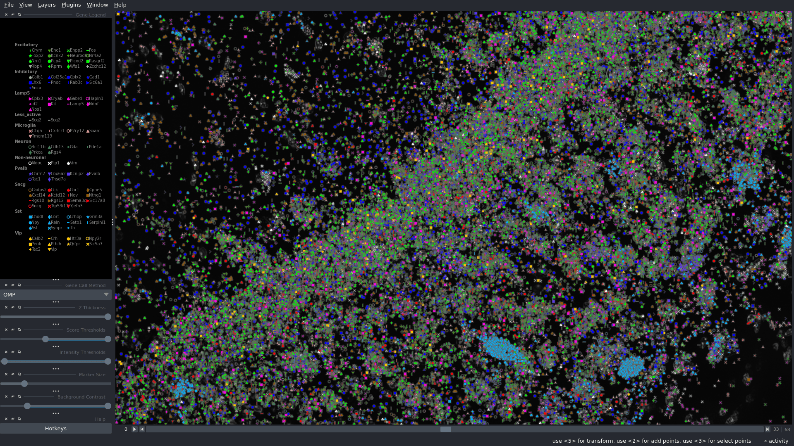

Diagnostics specific to a method are found in the [method](find_spots.md) tab.

## Viewer

The Viewer is the flagship diagnostic for viewing results. It is a fast, three-dimensional view of gene reads found
during [call spots](overview.md#call-spots) and [OMP](overview.md#orthogonal-matching-pursuit). The application is
powered by [napari](https://github.com/napari/napari).

### Opening

A Viewer can be displayed once coppafisher has run through at least [call spots](overview.md#call-spots). From the python
terminal:

```py
--8<-- "open_viewer_0.py"
```

or from the command line

```terminal
python -m coppafisher -v /path/to/notebook
```

where a napari window will be opened.

You can specify the colour and symbols of genes using a .csv file, then the Viewer can be opened by

```py
--8<-- "open_viewer_1.py"
```

or from the terminal

```terminal
python -m coppafisher -v /path/to/notebook --gene_marker /path/to/gene_marker.csv
```

see [here](https://github.com/paulshuker/coppafisher/raw/HEAD/coppafisher/plot/results_viewer/gene_colour.csv) for the
default gene marker file. The gene marker file supports all napari symbols that are shown under the `symbol` parameter
in their [documentation](https://napari.org/0.5.4/api/napari.layers.Points.html).

The default background image is a low resolution dapi image over all tiles produced during stitch. You can specify
custom images and their colour mappings in python

```py
from coppafisher import Notebook, Viewer

nb = Notebook("/path/to/notebook")
Viewer(nb, background_images=["/path/to/custom/background_image.npy", "dapi_detailed"], background_image_colours=["Reds", "gray"])
```

You can specify the background_images to be `#!python ["dapi_detailed"]` or `#!python ["anchor_detailed"]` for
16-bit precision background images.

The colourmaps can be any [vispy](https://vispy.org/api/vispy.color.colormap.html#vispy.color.colormap.get_colormaps)
or [matplotlib](https://matplotlib.org/stable/users/explain/colors/colormaps.html) colourmap.

If the background image(s) are custom files, they must be of shape `(im_y x im_x)` or `(im_z x im_y x im_x)`. They can
be a .npy file, a compressed .npz file with image at key `"arr_0"`, or a .tif file (based on the
[tifffile](https://github.com/cgohlke/tifffile) package). For further customisation, see the Viewer
[docstring](https://github.com/paulshuker/coppafisher/blob/HEAD/coppafisher/plot/results_viewer/base.py).

Specify no background images by setting `#!python background_images=[]`

Close the Viewer and all subplots by pressing Ctrl + C in the terminal.

### Description

By default, the greyscale signal in the background is the DAPI, where whiter regions indicate cells. Each gene is given
a shape and colour, shown in the gene legend.

For help with Viewer hotkeys and gene selection, press h. This includes further diagnostic subplots in the Viewer. Some
require a selected spot. Select a spot by pressing 3 and clicking on a spot. Then press 4 to continue panning.

The "Background Contrast" slider will affect the colour scale of the background image. "Marker Size" will change the
size of gene spots. "Z Thickness" allows for multiple z planes to be displayed at once. The "Score Thresholds" allows
the user to change the minimum and maximum spot scores to display. The "Intensity Thresholds" affects the minimum and
maximum allowed spot intensity to display The "Method" is the chosen method of gene calling. "Probability" is the Von-
Mises probability method, "Anchor" is the anchor method (see [call spots](overview.md#call-spots)), and "OMP" is the
Orthogonal Matching Pursuit method (see [OMP](overview.md#orthogonal-matching-pursuit)).

??? note "Multiple Background Images"

    With multiple background images, you will not see a background contrast slider anymore. This is intentional. to
    change the settings of each background image, click on Window -> Layer List and Window -> Layer Controls. From these
    windows, you have full control over the background images by selecting one. You can change their blending mode and
    opacity so you can see all your background images at once.

??? bug "Max Intensity Projection Toggle"

    It is a [known issue](https://github.com/paulshuker/coppafisher/issues/201) that toggling the Max Intensity
    Projection off displays the wrong z plane in the Viewer since it always shows the first z plane. To fix this, just
    jiggle the z position using the bottom slider and it will correctly update.

<figure markdown="span">
  { width="1100" }
  <figcaption>The Viewer</figcaption>
</figure>

## RegistrationViewer

### Opening

```python
from coppafisher import RegistrationViewer, Notebook

nb = Notebook("/path/to/notebook")
RegistrationViewer(nb, "/path/to/config.ini" t=t)
```

`t` is a tile index you want to view registration results for. If `t` is set to `None` (default), then the lowest tile
index is displayed.

## PDF Diagnostics

During a pipeline run, multiple .pdf files are created for different sections. These are located in the output
directory. If you want the PDFs to be created again, delete the old ones first, then
[run coppafisher](basic_usage.md/#running) again.

## Viewing images

### Extracted images

Extracted images are identical to raw images, these are viewed by

```python
from coppafisher import Notebook, plot

nb = Notebook("/path/to/notebook")
plot.view_extracted_images(nb, "/path/to/config.ini", tiles, rounds, channels)
```

where `tiles`, `rounds`, and `channels` are lists of integers specifying which images to view. Set these to `None` if
you wish to view all of the them from the sequencing images.

### Filtered images

Images after the [filter](overview.md#filter) stage are viewed by

```python
from coppafisher import Notebook, plot

nb = Notebook("/path/to/notebook")
plot.view_filtered_images(nb, tiles, rounds, channels, apply_colour_norm_factor=True, share_contrast_limits=True)
```

where `tiles`, `rounds`, and `channels` are lists of integers specifying which images to view. Set these to `None` if
you wish to view all of the them from the sequencing images. The boolean parameters can be set to `False` if needed. You
can also view the anchor round/channel. See `nb.basic_info.anchor_round` and `nb.basic_info.anchor_channel` for the
indices.

### Intensity images

You can view the computed intensities once call spots is complete. Do this by

```py
from coppafisher import Notebook, plot

nb = Notebook("/path/to/notebook")
plot.view_intensity_images(nb, tiles, z_planes=None)
```

`tiles` is a list of integers for each tile index to view. If set to `None`, the first tile is shown. When `z_planes` is
`None`, the first 20 z planes are shown, you can choose to show more z planes by setting `z_planes` to any number > 20.
The anchor images are also displayed for reference.
