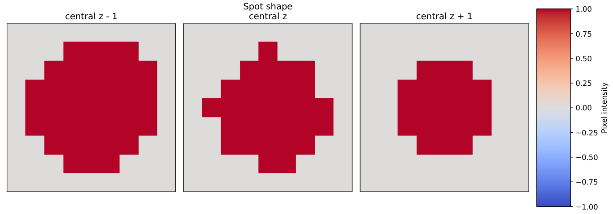

# Orthogonal Matching Pursuit (OMP)

OMP is coppafish's current best gene assignment algorithm. OMP runs independently, except requiring 
[register](overview.md#register) for image-alignment and [call spots](overview.md#call-spots) for dataset-accurate 
representation of each gene's unique barcode: its bled code ($\mathbf{B}_{grc}$). OMP does not explicitly differentiate 
between sequencing rounds and channels.

## Definitions

- $r$ and $c$ represents sequencing rounds and channels respectively.
- $\mathbf{B}_{grc}$ represents gene g's bled code in round $r$, channel $c$.
- $\mathbf{S}_{prc}$ is pixel $p$'s colour in round $r$, channel $c$, after pre-processing is applied.
- $\mathbf{c}_{pgi}$ is the OMP coefficient given to gene $g$ for image pixel $p$ on the $i$'th iteration. $i$ takes 
values $1, 2, 3, ...$
- $||A||_{...}$ represents an L2 norm of $A$ (or Frobenius norm for a matrix) over all indices replaced by a dot ($.$).

## 0: Pre-processing

All tile pixel colours are gathered using the results from register. Any out of bounds round/channel colour intensities 
are set to zero. 

## 1: Assigning the Next Gene

A pixel can have more than one gene assigned to it. The most genes allowed on each pixel is `max_genes` 
(typically `5`). Let's say we are on iteration $i$ ($i = 1, 2, 3, ...$) for pixel $p$. The pixel will already have 
$i - 1$ genes assigned to it and their coefficients have already been computed ($\mathbf{c}_{pg(i - 1)}$). We compute 
the latest residual pixel colour $\mathbf{R}_{prci}$ as 

$$
\mathbf{R}_{prci} = \mathbf{S}_{prc} - \sum_g(\mathbf{c}_{pg(i - 1)}\mathbf{B}_{grc})
$$

For the first iteration, $\mathbf{R}_{prc(i=1)} = \mathbf{S}_{prc}$. Using this residual, a dot product score is 
computed for every gene and background gene $g$ as 

$$
(\text{gene scores})_{pgi} = \frac{\sum_{rc}(\mathbf{B}_{grc}\mathbf{R}_{prci})}{||\mathbf{R}||_{p..i} + \lambda_d}
$$

A gene is successfully assigned to a pixel when all conditions are met:

- The best gene score is above `dp_thresh` (typically 0.225).
- The best gene is not already assigned to the pixel.
- The best gene is not a background gene.

The reasons for each of these conditions is:

- to remove poor gene reads and dim pixels.
- to not double assign genes.
- to avoid over-fitting on high-background pixel colour.

respectively. If a pixel fails to meet one or more of these conditions, then no more genes are assigned to it. If all 
remaining pixels fail the conditions, then the iterations stop and the coefficients $\mathbf{c}$ are kept as final.

## 2: Gene Coefficients

On each iteration, the gene coefficients are computed for the genes assigned to pixel $p$ to best represent the 
pixel's colour. All unassigned genes have a zero coefficient, so $g$ here represents only the assigned genes ($i$ 
assigned genes). The coefficients vector, $\mathbf{c}_{pgi}$, is of length $g$. $\mathbf{c}_{pgi}$ is computed through 
the method of least squares by minimising the scalar residual 

$$
\sum_{rc}(\mathbf{S}_{prc} - \sum_{g}(\mathbf{B}_{grc}\mathbf{c}_{pgi}))^2
$$

In other words, using matrix multiplication, the coefficient vector of length genes assigned is 

$$
\mathbf{c} = \bar{\mathbf{B}}^{-1} \bar{\mathbf{S}}
$$

where $\bar{(...)}$ represents flattening the round and channel dimensions into a single dimension, so 
$\bar{\mathbf{B}}$ is of shape $\text{genes assigned}$ by $\text{rounds}*\text{channels}$ and $\bar{\mathbf{S}}$ is of 
shape $\text{rounds} * \text{channels}$. $(...)^{-1}$ is the Moore-Penrose matrix inverse (a pseudo-inverse).

With the new, updated coefficients, step 1 is repeated on the remaining pixels unless $i$ is equal to `max_genes`.

## 3: Coefficient Post-Processing

The final coefficients, $\mathbf{c}_{pg}$ are normalised pixel-wise by

$$
\mathbf{c}_{pg} \rightarrow \frac{\mathbf{c}_{pg}}{||\mathbf{S}||_{p..} + \lambda_d}
$$

$\lambda_d$ should be on the order of background signal, typically $0.4$. What is left is a coefficient image the shape 
of a tile for every gene. Most of the coefficients will be zero and we should have spot-shaped non-zero coefficient 
shapes representing real gene expressions. The coefficients are not saved as this would require a lot of disk space.

## 4: Mean Spot Computation

OMP requires a good estimation of the average spot seen in the OMP coefficient images for spot scoring in the next 
step. To do this, isolated spots are found on gene coefficient images. The isolated spots are found using the 
[find_spots](find_spots.md) algorithm. `radius_yx` and `radius_z` are set by config variables 
`shape_isolation_distance_yx` (typically `10`) and `shape_isolation_distance_z` (default 
$\text{ceil}(\text{shape\_isolation\_distance\_yx}\times\frac{\text{pixel\_size\_xy}}{\text{pixel\_size\_z}})$). 
Instead of an automatic threshold, the coefficient detection threshold is set to `shape_coefficient_threshold` 
(typically `0.8`).

Once at least `spot_shape_max_spots_considered` (typically `100,000`) isolated spots are found (or there are no more 
isolated spots found), many are removed if they are too close to another isolated spot, even if they are for a 
different gene. This leaves highly quality spots that are well isolated from all genes.

With the remaining isolated spots, a 3D local coefficient region centred around each of them of shape `spot_shape` 
(typically `9x9x5`) is gathered. `spot_shape` must have odd numbers of pixels so that a single pixel can be centred. 
Each coefficient value is separately converted to its sign, i.e.

$$
\text{sign}(c) = \begin{cases} + 1 & \text{if } c \geq 0 \\ - 1 & \text{if } c \lt 0 \end{cases}
$$

Then the final mean spot is the mean over all isolated spots for each local region position to get a mean spot of shape 
`spot_shape`. By construction, the central pixel position will be $+1$ and all other positions will be $\geq -1$ and 
$\leq +1$. The mean spot can be seen in the `_omp.pdf` file produced at the end of the coppafish pipeline in the output 
directory.

<figure markdown="span">
  { width="700" }
  <figcaption>Mean spot example from real data.</figcaption>
</figure>

A spot is also created as just ones in every position where the mean spot is above `shape_sign_thresh` (typically 
`0.1`). This acts as a mask to only consider strong and positive mean spot expression during the scoring step.

<figure markdown="span">
  { width="700" }
  <figcaption>Spot example from real data.</figcaption>
</figure>

## 5: Pixel Scoring and Spot Detection

The gene coefficient images are converted to gene score images using the computed mean spot and spot from 
[step 4](#4-mean-spot-computation). A spot kernel is created of shape `spot_shape`. Each pixel is set to zero if the 
spot at that position is zero, otherwise it is set to the mean spot value. The kernel is divided by its sum. Then, the 
coefficient images are convolved with said kernel to give every pixel for every gene a "spot-likeliness score" to 
create a score image. Therefore, spot-shaped/high coefficient regions result in higher score maxima. Scores can be 
$\geq 0$, but, in practice, they are rarely greater than $0.7$.

Using the new spot score images, each gene's spots are detected using the [find spots](find_spots.md) algorithm to find 
score local maxima using config parameters `radius_xy` (typically `3`) and `radius_z` (typically `2`) respectively with 
a score threshold set by `score_threshold` (typically `0.1`). These are the final OMP gene reads shown in the 
[Viewer](diagnostics.md#viewer).

??? note "Why not score using only the coefficient values?"

    Coefficients can be inflated by single overly-bright round/channel anomalies since they are computed using a 
    non-robust least squares calculation. This could be from real autofluorescence or from mistakes in registration. 
    For this reason, a spot's score is better represented by using coefficient data from its neighbourhood. The mean 
    spot is an estimation of how much to care about the local neighbourhood.

## Diagnostics

### Viewer

Use the [Viewer](diagnostics.md#viewer) to check the final gene reads made by OMP.

### PDF

Check the `_omp.pdf` file created at runtime in the output directory for details on the OMP mean spot, the gene score 
distributions, gene counts, and gene locations.
