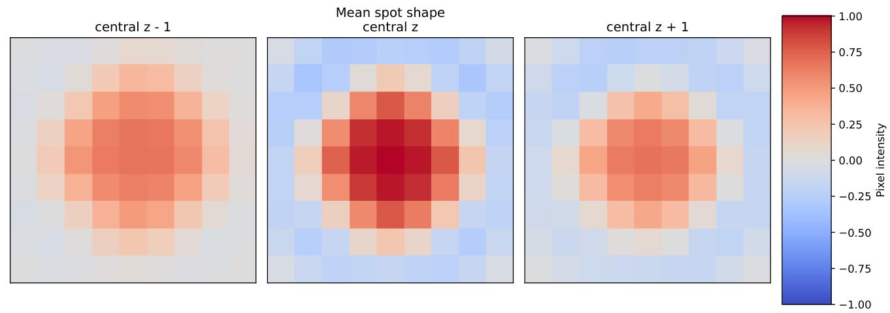

# Orthogonal Matching Pursuit (OMP)

OMP is coppafisher's current best gene assignment algorithm. OMP runs independently, except requiring
[register](overview.md#register) for image-alignment and [call spots](overview.md#call-spots) for dataset-accurate
representation of each gene's unique barcode: its bled code, $\mathbf{B}$.

A pixel score image is produced for every pixel and every gene by iterating through steps 2-4. Then, the final gene
reads are found in step 5.

## Definitions

- $r$ and $c$ represents sequencing rounds and channels respectively.
- $B_{grc}$ represents gene g's bled code in round $r$, channel $c$ saved at `nb.call_spots.bled_codes` from call spots.
- $S_{prc}$ is pixel $p$'s colour in round $r$, channel $c$, after pre-processing is applied.
- $c_{pgi}$ is the OMP pixel score given to gene $g$ at pixel $p$ on the $i$'th OMP iteration.
- $w_{pgi}$ is the OMP gene weight given to gene $g$ for image pixel $p$ on the $i$'th iteration. This is computed by
least squares in [step 3](#3-gene-weights). $i$ takes values $1, 2, 3, ...$
- $||A||_{...}$ represents an L2 norm of $A$ (or Frobenius norm for a matrix) over all indices replaced by a dot ($.$).

## 0: Pre-processing

All pixel colours are gathered using the results from register. Any out of bounds round/channel colour intensities are
set to zero. The pixel colours, $\mathbf{S}$, are multiplied by `nb.call_spots.colour_norm_factor` for the each tile.

## 1: Minimum Intensity Threshold

Before running on pixels, many pixels are discarded because they are background and not spots. To do this, we take the
middle z plane colours for each tile, $D_{txyrc}$, and compute their intensities as

$$
I_{txy} = \min_r(\max_c(|D_{txyrc}|))
$$

The intensity thresholds for each tile are then

$$
\text{minimum\_intensity}_t = a\times\text{nth percentile}_{xy}(I_{txy})
$$

$n$ is the `minimum_intensity_percentile` (typically 5) and $a$ is the `minimum_intensity_multiplier` (typically 4).

## 2: Next Gene Assignment

A pixel can have more than one gene assigned to it. The most genes allowed on each pixel is `max_genes`
(typically 5). Let's say we are on iteration $i$ ($i = 1, 2, 3, ...$) for pixel $p$. The pixel will already have
$i - 1$ genes assigned to it and their weights have been computed $(w_{pg(i - 1)})$. We compute the latest residual
pixel colour $R_{prci}$ as

$$
R_{prci} = S_{prc} - \sum_g(w_{pg(i - 1)}B_{grc})
$$

For the first iteration, $R_{prc(i=1)} = S_{prc}$. Using this residual, a "semi dot product score" is
computed for every gene and background gene $g$ similar to
[call spots](call_spots.md#6-and-7-application-of-scales-computation-of-final-scores-and-bleed-matrix)

$$
\text{(gene scores)}_{pgi} = \frac{1}{N_r}\Bigg|\sum_r\Bigg(\frac{1}{||\mathbf{\hat{R}}||_{pr.(i-1)}||\mathbf{B}||_{gr.}}\sum_{c}(\hat{R}_{prc(i - 1)}B_{grc})\Bigg)\Bigg|
$$

where

$$
\hat{R}_{prci} = \epsilon_{prci}^2R_{prci}\text{,}\space\space\space
\epsilon_{prci}^2 = N_r N_c\frac{\sigma_{pirc}^{-2}}{\sum_{rc}\sigma_{pirc}^{-2}}
$$

and

$$
\sigma_{pirc}^2 = \beta^2 + \alpha\sum_{g\text{ assigned}} w_{pg(i-1)}^2 B_{grc}^2\text{,}\space\space\space
N_r = \sum_r 1\text{,}\space\space\space
N_c = \sum_c 1
$$

$\alpha$ is given by `alpha` (typically 120) and boosts the uncertainty on round-channel pairs already strongly
weighted. $\beta$ is given by `beta` (typically 1) and gives every round-channel pair a constant uncertainty.

??? question "Why do we need an uncertainty weighting ($\mathbf{\epsilon}^2$) for each round-channel pair?"

    On real datasets, subtracting the assigned, weighted bled code is not perfect for every round (shown below).
    Therefore, $\mathbf{\epsilon}$ is a way of estimating the uncertainty associated with the imperfect gene weights. It
    places a bias towards genes that are bright in unique round-channel pairs when $\alpha>0$.

    By default, $\alpha >> \beta$ so it is unlikely to assign two genes bright in the same round-channel pairs.

    If you fully trust the weightings to be accurate, set `alpha` to zero in the config.

    <figure markdown="span">
      { height="300" }
      <figcaption>An example of OMP failing to find a scalar to correctly weight every bright round-channel pair for a
      gene. It is failing because the residual colour is sometimes very positive and sometimes very negative. Only the
      fourth round was almost perfectly subtracted.</figcaption>
    </figure>

Gene $\tilde{g}$ is successfully assigned to pixel $p$ when all conditions are met:

- $(\text{gene scores})_{p\tilde{g}i}$ is the largest scoring gene.
- $(\text{gene scores})_{p\tilde{g}i} >$ `dot_product_threshold` (typically 0.5).
- $\tilde g$ is not already assigned to the pixel.
- $\tilde g$ is not a background gene.
- The residual intensity $\min_r(\max_c(|\hat{R}_{prci}|)) > \text{minimum\_intensity}_t$. See [diagnostic](diagnostics.md#intensity-images).
- Iteration $i \leq$ `max_genes`.

The reasons for each of these conditions is to:

- pick the best gene
- remove unconfident gene reads
- not double assign genes
- avoid over-fitting on high-background pixel colour
- remove dim colours (background noise)
- avoid assigning too many genes

respectively. If a pixel fails to meet one or more of these conditions, then no more genes are assigned to it and the
pixel scores will be final.

If pixel $p$ meets all conditions, then gene $\tilde g$ is taken as the next gene assigned.

If all remaining pixels fail the conditions, then the iterations stop and the current pixel scores $\mathbf{c}$ are kept
as final for [step 5](#5-spot-scoring-and-spot-detection).

## 3: Gene Weights

On each iteration, the gene weights are re-computed for all genes assigned to pixel $p$ to best represent the pixel's
colour. All unassigned genes have a zero weight, so $g$ here represents only the assigned genes ($i$ assigned genes)
for pixels that passed [step 2](#2-next-gene-assignment). The weights, $w_{pgi}$, are computed through the
method of least squares by minimising the scalar residual

$$
\sum_{rc}(S_{prc} - \sum_{g\text{ assigned}}(B_{grc}w_{pgi}))^2
$$

In other words, using matrix multiplication, the weight vector of length genes assigned is

$$
\mathbf{w} = \bar{\mathbf{B}}^{-1} \bar{\mathbf{S}}
$$

where $\bar{(...)}$ represents flattening the round and channel dimensions into a single dimension, so
$\bar{\mathbf{B}}$ is of shape $\text{genes assigned}$ by $\text{rounds}*\text{channels}$ and $\bar{\mathbf{S}}$ is of
shape $\text{rounds} * \text{channels}$. $(...)^{-1}$ is the Moore-Penrose matrix inverse (a pseudo-inverse).

## 4: Pixel Scores

After updating the gene weights, every assigned gene pixel score is (re)computed for pixels that passed gene assignment.
The pixel score for assigned gene $g$ in pixel $p$ is given by

$$
c_{pgi} = \frac{1}{N_r ||\mathbf{\tilde{R}}||_{pgr.i}}\Bigg | \sum_{rc}\tilde{R}_{pgrci} \hat{B}_{grc} \Bigg |
$$

where

$$
\tilde{R}_{pgrci} = \epsilon_{prci}^2\Big(S_{prc} - \sum_{g'\text{ assigned except }g}B_{g'rc}w_{pg'i}\Big)
$$

and

$$
\epsilon_{pgrci}^2 = N_r N_c \frac{\sigma_{pgirc}^{-2}}{\sum_{rc} \sigma_{pgirc}^{-2}} \text{,}\space\space\space
\sigma_{pgirc}^2 = \beta^2 + \alpha \sum_{g'\text{ assigned except }g}w_{pg'i}^2 B_{g'rc}^2
$$

A pixel score is made negative if the gene's weight is negative.

Step 2 is now repeated on the remaining pixels unless $i$ is $\text{max\_genes}$ (i.e. the last iteration).

??? question "Why not use the scores from step 2 as the pixel scores?"

    If you recall, from [step 2](#2-next-gene-assignment), the assigned gene is given a preliminary score similar to
    step 4's pixel score. This score is not used as the final OMP pixel scores (but, we did try). This is because the
    pleminary score has lowered the scores because they overlap with other genes. In other words, the scores are lowered
    by brightness in other rounds-channel pairs.

    The step 4 scoring method gets around this. Assuming that all gene assignments are perfect, by subtracting those
    assignments off except gene g, then gene g is given a fairer chance of scoring highly, hopefully without the
    brightness of other genes.

## 5: Spot Scoring and Spot Detection

The gene pixel score images are converted to gene score images by convolving with the mean spot given as a numpy .npy
file at file path `omp_mean_spot` in the `file_names` config section. If `omp_mean_spot` is not given, the default mean
spot is used (shown below). The mean spot is divided by its sum then used. This gives a score for every pixel for every
gene. Spot-shaped and high pixel score regions result in higher score maxima. Scores can be $\geq 0$. But, in practice,
scores are rarely greater than $1$.

<figure markdown="span">
  { width="776" }
  <figcaption>The default mean spot. The middle image is the central z plane.</figcaption>
</figure>

Using the score images, each gene's spots are detected using the [find spots](find_spots.md) algorithm to find score
local maxima using config parameters `radius_xy` (typically `3`) and `radius_z` (typically `2`) respectively with a
score threshold set by `score_threshold` (typically `0.1`). These are the final OMP gene reads shown in the
[Viewer](diagnostics.md#viewer).

??? question "Why not score each spot using a single pixel score value?"

    Pixel scores can be inflated by single overly-bright round/channel anomalies since they are computed using a
    non-robust least squares calculation. This could be from real autofluorescence or from mistakes in registration.
    For this reason, a spot's score is better represented by using pixel score data from its neighbourhood. The mean
    spot is an estimation of how much care to put in the local, spatial neighbourhood.

    If you still wanted to score each spot by a single pixel score value, create your own 1x1x1 mean spot with value
    $>0$ and run OMP again.

## Diagnostics

### Intensity

It is recommended to view the pixel intensities on a histogram first by typing

```py
--8<-- "omp_intensity_histogram.py"
```

On this plot, you can see vertical lines to indicate important intensity values.

Use the [diagnostic](diagnostics.md#intensity-images) to see intensity images. Once OMP is complete, you can view the
minimum intensity computed for each tile by doing

```py
--8<-- "omp_min_intensity.py"
```

where `tile` is the tile index.

### Viewer

Use the [Viewer](diagnostics.md#viewer) to check the final gene reads made by OMP.

### PDF

Check the `_omp.pdf` file created at runtime in the output directory for details on the OMP mean spot, the spot score
distributions, gene counts, and gene locations.
